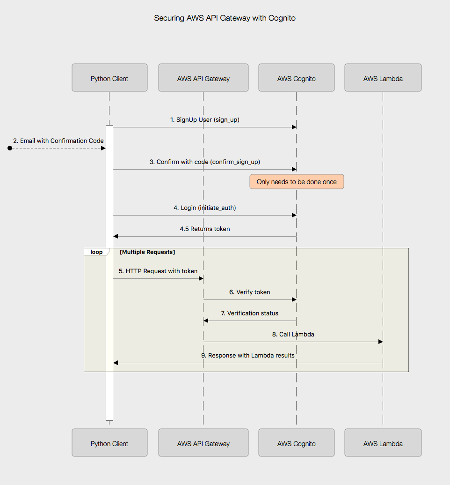

# Cognito secured API Gateway with Python Client

This repo contains the working example to go along with a blog post about how to secure an API Gateway endpoint with a Cognito User Pool using a Python client.

Traditionally, a post about an AWS Serverless application included DynamoDB and a Web front end, usually involving Reactjs and Amplifyjs but I wanted to focus on securing the API with Cognito without the distraction of the other technologies.

The basic flow looks like the following:




## How to run this yourself.

### .env

you will need a ```.env``` file in this root directory.  It should contain the following:

```text

# cognito pool creds - NEVER CHECK IN
USER_POOL_ID=<Cognito User Pool ID>
CLIENT_ID=<Cognito Client ID>
CLIENT_SECRET=<Cognito Client Secret>
EMAIL=<Email address where you can receive a confirmation code>
PASSWORD=<A password, fake and not anything real, that you use to log into Cognito>
AWS_PROFILE=<AWS Profile Name, assuming you run this from your local machine>
AWS_API_GATEWAY_URL=<URL of the API Gateway>

```

### Lambda
You will need to create a Lambda and deploy it.  You do not have to use the one here, ```add_note_lambda.py``` but if you do, you will need to create a zip distribution.

There is a MacOS/Linux script to do this called, ```build_add_notes.sh```.  The steps are:

```text
pip install boto3 -t ./add_notes_deploy/
pip install python-jose -t ./add_notes_deploy/
cp add_note_lambda.py ./add_notes_deploy
cd ./add_notes_deploy; zip -r ../add_notes_deploy.zip .; cd ..
```

### Jupyter Notebook

The Jupyter notebook walks through the steps to signup, confirm, login, and refresh token.  The notebook is annotated and is meant to be walked through to provide an idea around how to interact with Cognito and API Gateway.

